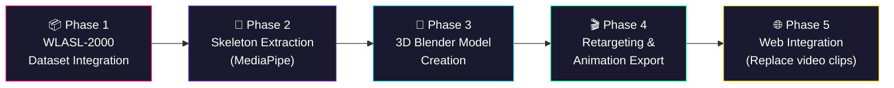
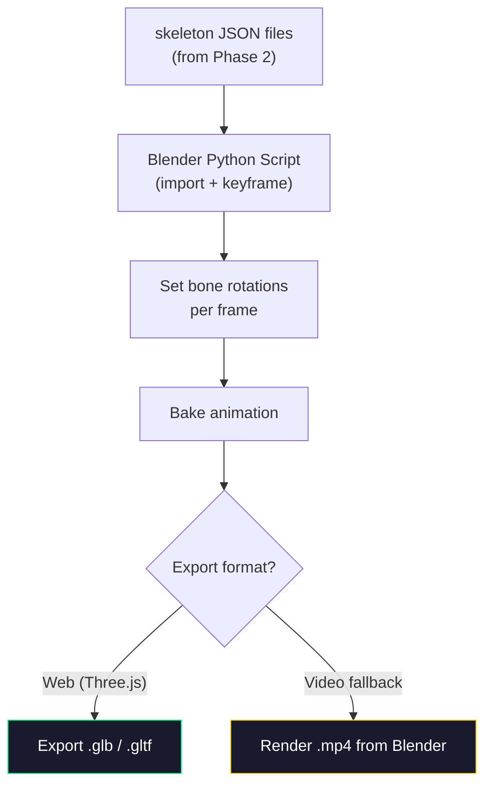

# Future Execution Plan: WLASL → Skeleton → 3D Avatar Pipeline

Based on your [future_plan.txt](file:///c:/Users/Asus/OneDrive/Desktop/sem_6_isl_project/future_plan.txt), here is a detailed execution roadmap.

---

## Overview



---

## Phase 1: WLASL-2000 Dataset Integration

### Goal
Replace the current 116-word ISL video library with WLASL-2000's 2,000-word ASL library.

### Dataset Structure
WLASL-2000 uses a JSON mapping file (`WLASL_v0.3.json`) with this structure:

```json
[
  {
    "gloss": "hello",
    "instances": [
      {
        "video_id": "06233",
        "signer_id": 15,
        "fps": 25,
        "frame_start": 1,
        "frame_end": -1,
        "split": "train",
        "url": "https://...",
        "bbox": [xmin, ymin, xmax, ymax]
      }
    ]
  }
]
```

### Steps

| Step | Action | Tools / Commands | Output |
|------|--------|------------------|--------|
| 1.1 | Download WLASL-2000 from Kaggle or clone the GitHub repo | `git clone https://github.com/dxli94/WLASL.git` | Raw dataset + JSON |
| 1.2 | Download all videos using the provided script | `python video_downloader.py` | ~21,000 [.mp4](file:///c:/Users/Asus/OneDrive/Desktop/sem_6_isl_project/Audio-Speech-To-Sign-Language-Converter/assets/A.mp4) files |
| 1.3 | Write a Python script to **select 1 best video per gloss** | Pick the video with the best quality (largest file, highest FPS, full-frame) | 2,000 curated videos |
| 1.4 | Rename each selected video from `{video_id}.mp4` → `{Gloss}.mp4` | Script: `os.rename(f"{video_id}.mp4", f"{gloss.title()}.mp4")` | [Hello.mp4](file:///c:/Users/Asus/OneDrive/Desktop/sem_6_isl_project/Audio-Speech-To-Sign-Language-Converter/assets/Hello.mp4), [Thank.mp4](file:///c:/Users/Asus/OneDrive/Desktop/sem_6_isl_project/Audio-Speech-To-Sign-Language-Converter/assets/Thank.mp4), etc. |
| 1.5 | Copy the renamed videos into your project's `assets/` folder | Replace existing files | 2,000 word videos + 26 letters + 10 numbers |

### Script Skeleton (Step 1.3–1.4)

```python
import json, os, shutil

with open('WLASL_v0.3.json') as f:
    data = json.load(f)

for entry in data:
    gloss = entry['gloss']
    instances = entry['instances']
    
    # Pick the first "train" split instance as the representative
    best = next((i for i in instances if i['split'] == 'train'), instances[0])
    video_id = best['video_id']
    
    src = f"videos/{video_id}.mp4"
    dst = f"assets_wlasl/{gloss.title()}.mp4"
    
    if os.path.exists(src):
        shutil.copy2(src, dst)
        print(f"✅ {gloss} → {dst}")
```

> [!WARNING]
> **Licensing**: WLASL is licensed under the **Computational Use of Data Agreement (C-UDA)** — for **academic/research use only**, not commercial. This is fine for a semester project.

> [!IMPORTANT]
> **Language change**: This switches your project from **ISL to ASL**. If your professor requires ISL specifically, you'll need to keep your original ISL videos and only use WLASL as a reference/supplement.

---

## Phase 2: Skeleton Extraction (MediaPipe)

### Goal
Extract 3D body + hand pose landmarks from each WLASL video to create skeleton animation data.

### Why MediaPipe?
| Tool | Body Points | Hand Points | Speed | Cost |
|------|-------------|-------------|-------|------|
| **MediaPipe** | 33 landmarks | 21 per hand | Real-time | Free |
| OpenPose | 25 landmarks | 21 per hand | Slower | Free |
| Rokoko | 23 landmarks | 20 per hand | Real-time | Paid |

MediaPipe is the best fit — it's free, fast, and gives **33 body + 21×2 hand = 75 landmarks** per frame.

### Steps

| Step | Action | Details |
|------|--------|---------|
| 2.1 | Install dependencies | `pip install mediapipe opencv-python numpy` |
| 2.2 | Write an extraction script | Process each WLASL video frame-by-frame |
| 2.3 | Save landmarks to JSON or BVH | One file per word: `Hello_skeleton.json` |
| 2.4 | Quality check | Visualize skeletons on a few samples |

### Extraction Script Skeleton

```python
import cv2
import mediapipe as mp
import json

mp_pose = mp.solutions.pose
mp_hands = mp.solutions.hands

def extract_skeleton(video_path):
    cap = cv2.VideoCapture(video_path)
    frames_data = []
    
    with mp_pose.Pose(min_detection_confidence=0.5) as pose, \
         mp_hands.Hands(min_detection_confidence=0.5) as hands:
        
        while cap.isOpened():
            ret, frame = cap.read()
            if not ret:
                break
            
            rgb = cv2.cvtColor(frame, cv2.COLOR_BGR2RGB)
            
            # Body pose (33 landmarks)
            pose_result = pose.process(rgb)
            body = []
            if pose_result.pose_world_landmarks:
                for lm in pose_result.pose_world_landmarks.landmark:
                    body.append({"x": lm.x, "y": lm.y, "z": lm.z})
            
            # Hands (21 landmarks × 2)
            hand_result = hands.process(rgb)
            hand_data = []
            if hand_result.multi_hand_landmarks:
                for hand_lm in hand_result.multi_hand_landmarks:
                    hand = [{"x": lm.x, "y": lm.y, "z": lm.z} 
                            for lm in hand_lm.landmark]
                    hand_data.append(hand)
            
            frames_data.append({
                "body": body,
                "hands": hand_data
            })
    
    cap.release()
    return frames_data

# Process all videos
for video_file in os.listdir("assets_wlasl"):
    word = video_file.replace(".mp4", "")
    data = extract_skeleton(f"assets_wlasl/{video_file}")
    with open(f"skeletons/{word}.json", "w") as f:
        json.dump(data, f)
    print(f"✅ Extracted: {word} ({len(data)} frames)")
```

### Output Format (per word)

```json
{
  "word": "Hello",
  "fps": 25,
  "frames": [
    {
      "body": [
        {"x": 0.5, "y": 0.3, "z": -0.1},
        ...  
      ],
      "hands": [
        [{"x": 0.7, "y": 0.4, "z": 0.0}, ...],
        [{"x": 0.3, "y": 0.4, "z": 0.0}, ...]
      ]
    }
  ]
}
```

---

## Phase 3: 3D Blender Model Creation

### Goal
Create or obtain a humanoid 3D model with a **rigged armature** that matches the MediaPipe skeleton structure.

### Options

| Option | Effort | Quality | Recommended |
|--------|--------|---------|-------------|
| **MakeHuman + Rigify** | Low | Good | ✅ Best for this project |
| Custom Blender model | High | Custom | For advanced users |
| Mixamo character | Low | Good | Easy but limited customization |
| ReadyPlayerMe avatar | Low | Good | Web-friendly, but needs API |

### Recommended Approach: MakeHuman → Blender

| Step | Action | Details |
|------|--------|---------|
| 3.1 | Download MakeHuman | Free, open-source human model generator |
| 3.2 | Create a neutral character | Design a simple, universally readable character |
| 3.3 | Export as `.fbx` or `.mhx2` | With skeleton/armature included |
| 3.4 | Import into Blender | File → Import → FBX |
| 3.5 | Apply Rigify rig | Add detailed bone structure for hands/fingers |
| 3.6 | Create bone mapping | Map MediaPipe's 75 landmarks → Blender armature bones |

### Bone Mapping Table (MediaPipe → Blender Rigify)

```
MediaPipe Landmark     →  Blender Rigify Bone
──────────────────────────────────────────────
0  (nose)              →  head
11 (left_shoulder)     →  shoulder.L
12 (right_shoulder)    →  shoulder.R
13 (left_elbow)        →  upper_arm.L
14 (right_elbow)       →  upper_arm.R
15 (left_wrist)        →  forearm.L
16 (right_wrist)       →  forearm.R
23 (left_hip)          →  thigh.L
24 (right_hip)         →  thigh.R
Hand 0 (wrist)         →  hand.L / hand.R
Hand 4 (thumb_tip)     →  thumb.03.L
Hand 8 (index_tip)     →  f_index.03.L
Hand 12 (middle_tip)   →  f_middle.03.L
Hand 16 (ring_tip)     →  f_ring.03.L
Hand 20 (pinky_tip)    →  f_pinky.03.L
```

---

## Phase 4: Retargeting & Animation Export

### Goal
Apply extracted skeleton data to the 3D model and export animations.

### Workflow


### Steps

| Step | Action | Details |
|------|--------|---------|
| 4.1 | Write Blender Python script | Reads skeleton JSON → sets bone keyframes |
| 4.2 | Run script in batch mode | `blender --background --python retarget.py` |
| 4.3 | Choose export format | **Option A**: `.glb` for real-time 3D in browser. **Option B**: Render [.mp4](file:///c:/Users/Asus/OneDrive/Desktop/sem_6_isl_project/Audio-Speech-To-Sign-Language-Converter/assets/A.mp4) videos |
| 4.4 | Export 2,000 animations | One file per word |

### Blender Retargeting Script Skeleton

```python
import bpy
import json

def apply_skeleton_to_model(json_path, armature_name="Armature"):
    with open(json_path) as f:
        data = json.load(f)
    
    armature = bpy.data.objects[armature_name]
    bpy.context.view_layer.objects.active = armature
    bpy.ops.object.mode_set(mode='POSE')
    
    for frame_idx, frame in enumerate(data["frames"]):
        bpy.context.scene.frame_set(frame_idx + 1)
        
        # Map MediaPipe body landmarks to bone positions
        if frame["body"]:
            # Example: Set right shoulder rotation
            bone = armature.pose.bones["upper_arm.R"]
            mp_shoulder = frame["body"][12]  # right_shoulder
            mp_elbow = frame["body"][14]     # right_elbow
            # Calculate rotation from shoulder→elbow vector
            # ... (rotation math here)
            bone.keyframe_insert(data_path="rotation_quaternion")
        
        # Map hand landmarks to finger bones
        if frame["hands"]:
            for hand_idx, hand in enumerate(frame["hands"]):
                side = "L" if hand_idx == 0 else "R"
                # Set finger bone rotations...
    
    # Bake animation
    bpy.ops.nla.bake(frame_start=1, frame_end=len(data["frames"]))
```

---

## Phase 5: Web Integration

### Goal
Replace raw video playback in your Django app with 3D animated model playback.

### Two Approaches

````carousel
### Option A: Real-time 3D in Browser (Three.js) ⭐ Recommended

Replace the `<video>` player with a **Three.js** canvas that loads `.glb` models and plays animations.

```
assets/
├── model.glb              ← The 3D character (loaded once)
├── animations/
│   ├── Hello.glb          ← Animation clip per word
│   ├── Good.glb
│   ├── College.glb
│   └── ... (2,000 files)
```

**Pros**: Smaller files, customizable avatar, smoother transitions
**Cons**: Requires Three.js knowledge, browser GPU needed
<!-- slide -->
### Option B: Pre-rendered Videos (Simpler)

Render each animation as an `.mp4` from Blender — **zero frontend changes** needed.

```
assets/
├── Hello.mp4              ← Rendered from 3D model
├── Good.mp4
├── College.mp4
└── ... (2,000 files)
```

**Pros**: No frontend changes at all, works exactly like today
**Cons**: Larger file sizes, no real-time customization
````

---

## Timeline Estimate

| Phase | Task | Estimated Time | Difficulty |
|-------|------|---------------|------------|
| **1** | WLASL-2000 download + curation | 2–3 days | 🟢 Easy |
| **2** | MediaPipe skeleton extraction | 3–4 days | 🟡 Medium |
| **3** | 3D model creation (MakeHuman + Rigify) | 3–5 days | 🟡 Medium |
| **4** | Retargeting + animation export | 5–7 days | 🔴 Hard |
| **5A** | Three.js web integration | 4–5 days | 🔴 Hard |
| **5B** | Pre-rendered video (alternative) | 1–2 days | 🟢 Easy |
| | **Total (with Option A)** | **~3–4 weeks** | |
| | **Total (with Option B)** | **~2–3 weeks** | |

---

## Required Tools & Libraries

| Tool | Purpose | Install |
|------|---------|---------|
| Python 3.8+ | Scripting | Already installed |
| MediaPipe | Pose/hand extraction | `pip install mediapipe` |
| OpenCV | Video processing | `pip install opencv-python` |
| Blender 3.6+ | 3D modeling & animation | [blender.org](https://www.blender.org/download/) |
| MakeHuman | Character generation | [makehumancommunity.org](http://www.makehumancommunity.org/) |
| Three.js (Option A) | Browser 3D rendering | CDN or npm |
| NumPy | Math operations | `pip install numpy` |

---

## Key Risks & Mitigations

| Risk | Impact | Mitigation |
|------|--------|------------|
| WLASL videos have expired URLs | Can't download all 2,000 words | Contact dataset authors for pre-packaged download, or use Kaggle mirror |
| Poor pose extraction on some videos | Missing/jittery skeleton data | Filter out low-confidence frames, interpolate gaps |
| Hand landmarks are noisy | Finger signs look wrong | Apply smoothing (Savitzky-Golay filter), increase detection confidence threshold |
| Bone mapping is incorrect | Avatar moves unnaturally | Iterate on the mapping table, use reference poses for calibration |
| ISL vs ASL requirement | Professor may reject ASL signs | Keep your existing ISL videos as fallback, clearly label the project as ASL |
